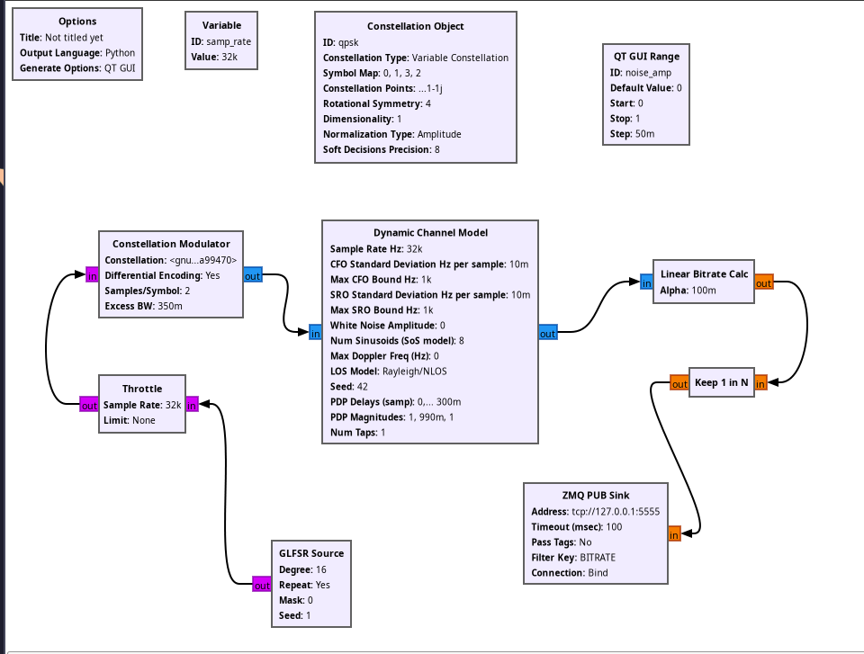
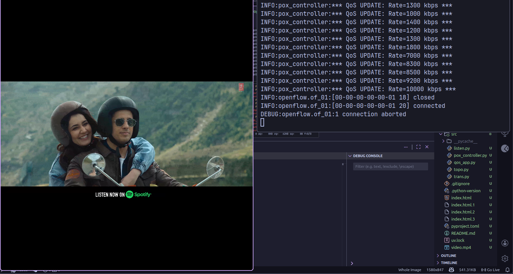
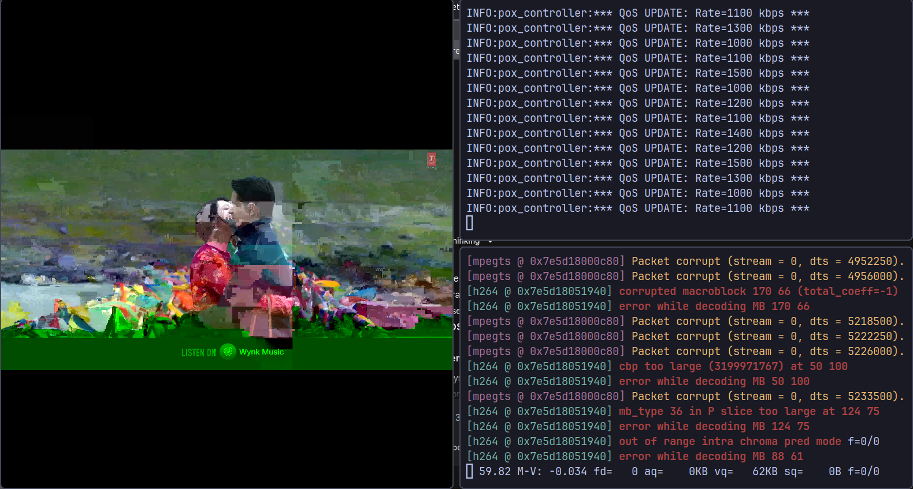

# Adaptive Streaming with SDN

A small demo repository combining adaptive video streaming utilities and an SDN-based controller/experiment codebase. This project demonstrates how network conditions (simulated via GNU Radio) impact video quality and how an adaptive system can respond.

## Project Overview

- **Purpose:** Tools and example code for studying adaptive bitrate streaming and QoS in a Software-Defined Network (SDN) testbed.
- **Components:**
- **Mininet:** Simulates the network topology.
- **POX Controller:** Manages OpenFlow switches and enforces QoS bandwidth limits.
- **GNU Radio:** Simulates the physical layer channel (Signal-to-Noise Ratio) to trigger QoS decisions.
- **FFmpeg/FFplay:** Generates and displays the video traffic.

## Repo Structure

- `grc/` — GNU Radio Companion flowgraph and generated Python blocks.
- `src/` — SDN controller and helper scripts (e.g. `pox_controller.py`, `qos_app.py`, `topo.py`).
- `imgs/` — Images used in documentation or experiments.
- `index.html` — Small HTML files used for captive portal or HTTP tests.

## Requirements

- Python 3.8+ (adjust as needed for your environment).
- **GNU Radio:** Required to run the signal processing blocks in `grc/`.
- **Mininet:** For network emulation.
- **POX Controller:** The SDN controller environment required by `src/pox_controller.py`.
- **FFmpeg:** Installed on the host system for video streaming.

---

## Setup Guide

Follow these steps to bring up the simulation environment.

### 1. Start the SDN Controller

First, start the POX controller. This listener will manage the Mininet switches and handle QoS updates.

```bash
sudo ~/WorkspaceSDN/pox/pox.py log.level --debug openflow.of_01 --port=6653 pox_controller

```

### 2. Start the Network Topology

In a new terminal window, launch the Mininet topology. This creates the virtual hosts (`h1`, `h2`) and connects them to the remote controller started in Step 1.

```bash
sudo python3 src/topo.py

```

### 3. Run the GNU Radio Flowgraph (Optional)

Open the flowgraph located in `grc/` to simulate the wireless channel conditions. This script calculates the "Signal Power" and sends bitrate commands to the SDN controller via ZMQ.

_Figure 1: The GNU Radio flowgraph processing signal power to determine network bitrate._



---

## Running the Video Experiment

Once Mininet is running, use the Mininet CLI (`mininet>`) to start the video stream.

**1. Start the Receiver (Host 2):**
This commands `h2` to listen for the UDP video stream.

```bash
h2 ffplay -an -autoexit -fflags nobuffer -flags low_delay -framedrop -strict experimental -probesize 32 -sync ext udp://0.0.0.0:1234 &

```

**2. Start the Sender (Host 1):**
This commands `h1` to stream `video.mp4` using H.264 encoding with Intra-Refresh (to prevent freezing during packet loss).

```bash
h1 ffmpeg -re -stream_loop -1 -i video.mp4 -c:v libx264 -b:v 3M -maxrate 3M -bufsize 6M -preset ultrafast -tune zerolatency -intra-refresh 1 -pkt_size 1316 -f mpegts udp://10.0.0.2:1234 &

```

---

## Experimental Results

### Normal Operation (High Bandwidth)

When the channel signal is strong (simulated via GNU Radio slider or defaults), the SDN controller allocates full bandwidth (e.g., 5-10 Mbps). The video is clear and smooth.

<!-- _Figure 2: Clear video stream under optimal network conditions._ -->

<!--  -->

### Adaptive Throttling (Low Bandwidth)

When noise is introduced or the channel degrades, the controller throttles the link (e.g., to 1 Mbps). The high-bitrate stream overflows the narrow pipe, causing controlled visual artifacts ("datamoshing"), demonstrating the need for bitrate adaptation.

_Figure 3: Visual artifacts and pixelation occurring when the controller enforces a QoS bandwidth limit._



---

## Contributing

Open an issue or submit a pull request with improvements or bug fixes.
